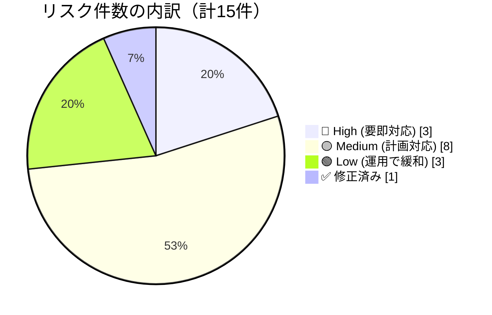
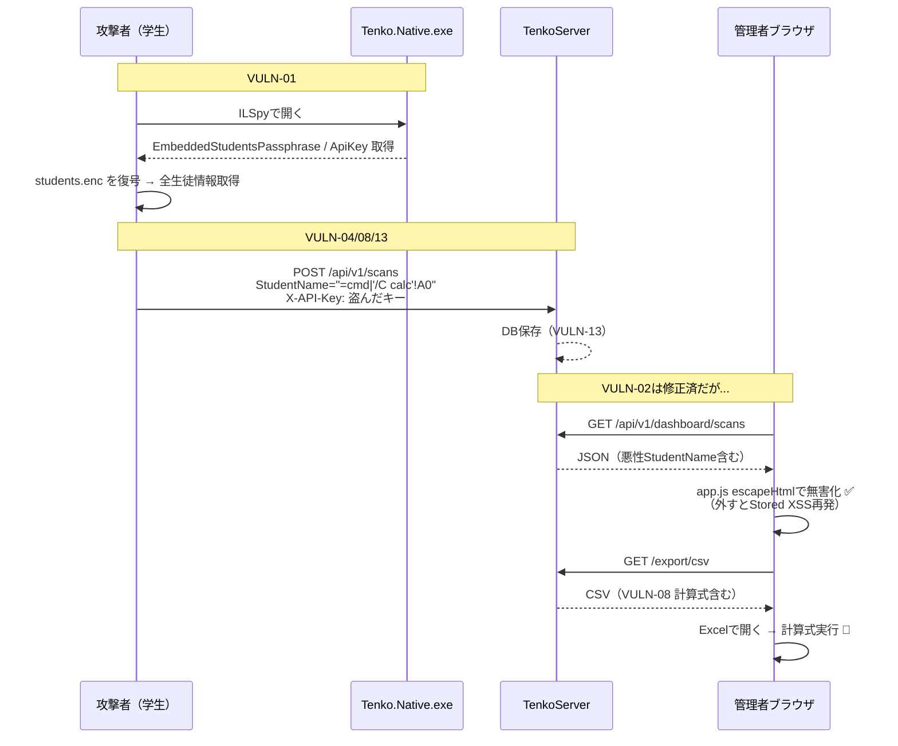
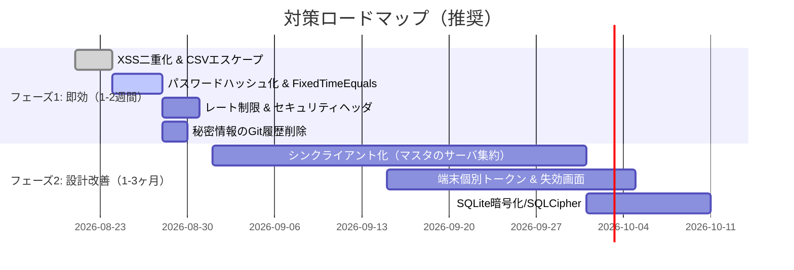

# BarcodeTenko2 セキュリティ診断レポート — わかりやすいビジュアル版

> **文書番号** `SEC-REPORT-2026-001-Visual` \
> **対象** `BarcodeTenko2` (Client: `Tenko.Native` / Server: `TenkoServer`) \
> **作成日** 2026年8月21日 \
> **作成者** 自動診断 (Code Review + 動的検証) \
> **分類** 🟢 防御的・教育目的 — 悪用厳禁

---

## 目次
1. [ひと目でわかる結論](#ひと目でわかる結論)
2. [リスク一覧マトリクス](#リスク一覧マトリクス)
3. [深刻度レジェンド](#深刻度レジェンド)
4. [詳細: 既報7件の検証結果](#詳細-既報7件の検証結果)
5. [詳細: 今回新たに検出した8件](#詳細-今回新たに検出した8件)
6. [攻撃シナリオ図](#攻撃シナリオ図)
7. [今すぐできる対策ロードマップ](#今すぐできる対策ロードマップ)
8. [検証方法と証跡](#検証方法と証跡)
9. [用語集（非エンジニア向け）](#用語集)
10. [付録: 影響範囲とCVSS目安](#付録)

---

## ひと目でわかる結論

### 一行まとめ
> **学内閉域での利便性は高いが、配布端末から個人情報が復元可能 & 管理画面のパスワードが平文 — この2点はすぐ直すべき。XSSは既に修正済み。**



| 区分 | 件数 | 代表例 |
|---|---:|---|
| 🔴 High | 3 | 逆コンパイルで個人情報漏洩 / XSS(修正済) / CSVインジェクション |
| 🟡 Medium | 8 | 平文パスワード / 共通APIキー / CSRF / レート制限なし 等 |
| 🟢 Low | 3 | SQLite平文 / バーコードなりすまし 等 |
| ✅ 修正済 | 1 | Stored XSS は `escapeHtml` で解消 |

> [!CAUTION]
> **VULN-01（逆コンパイル）** は構造的な問題です。アプリを配布した時点で `students.enc` + `exe` を持つ人は全生徒情報を復元できます。学外配布やUSB紛失を想定するなら最優先で設計変更を。

> [!NOTE]
> **良い点**: `app.js:12` のXSS対策は全箇所で徹底、`StudentMasterService.cs:228` のHMAC検証や `ScansController.cs:63` の重複排除は適切に実装されています。

---

## リスク一覧マトリクス

### 既報 7件（`SECURITY_REPORT.md:16` 由来）の検証結果

| ID | 項目 | 深刻度 | 悪用難易度 | 対応 | 検証 |
|---|---|:---:|:---:|:---:|---|
| **VULN-01** | クライアント逆コンパイルで鍵・APIキー抽出 | 🔴 High | 低 | ❌ 未対応 | `src/Tenko.Native/Tenko.Native.csproj:25` / `tools/Generate-EmbeddedPassphrase.ps1:33` で再現確認 |
| **VULN-02** | Stored XSS（管理画面） | 🔴 High | 中 | ✅ 修正済 | `src/TenkoServer/wwwroot/js/app.js:12` `escapeHtml` 全適用確認 |
| **VULN-03** | 管理者パスワード平文・デフォルト値 | 🟡 Medium | 低 | ❌ 未対応 | `src/TenkoServer/Controllers/AuthController.cs:32` 平文比較 |
| **VULN-04** | 単一共有APIキー（端末失効不可） | 🟡 Medium | 低 | ❌ 未対応 | `src/TenkoServer/Middleware/ApiKeyAuthMiddleware.cs:34` |
| **VULN-05** | Power Automate Webhook 悪用 | 🟡 Medium | 中 | ❌ 未対応 | `src/TenkoServer/Services/NotificationBackgroundService.cs:91` |
| **VULN-06** | バーコード物理なりすまし（代理点呼） | 🟡 Medium | 低 | 仕様 | `src/Tenko.Native/ViewModels/MainViewModel.cs:261` 5/10桁のみ |
| **VULN-07** | SQLite平文保存 | 🟢 Low | 高 | ❌ 未対応 | `src/TenkoServer/Program.cs:23` 暗号化なし |

### 新規検出 8件（今回のコード監査で追加）

| ID | 項目 | 深刻度 | 証跡 `file:line` |
|---|---|:---:|---|
| **VULN-08** | CSVインジェクション（Excel計算式実行） | 🔴 High | `src/TenkoServer/Controllers/DashboardController.cs:148` |
| **VULN-09** | タイミング攻撃（パスワード/APIキー比較） | 🟡 Medium | `AuthController.cs:32` / `ApiKeyAuthMiddleware.cs:34` |
| **VULN-10** | セキュリティヘッダ欠如（CSP/HSTS等なし） | 🟡 Medium | `src/TenkoServer/Program.cs:80` |
| **VULN-11** | レート制限なし（総当たり/DoS） | 🟡 Medium | `Program.cs:68` / `ScansController.cs:35` |
| **VULN-12** | CSRF（Cookie認証にトークンなし） | 🟡 Medium | `Program.cs:45` |
| **VULN-13** | 任意 `StudentName` 保存 → 二次XSS温床 | 🟡 Medium | `ScansController.cs:74` |
| **VULN-14** | 無制限バッチPOSTでDoS/DB肥大化 | 🟢 Low | `Models/DTOs/ScanDtos.cs:20` / `Services/NotificationQueue.cs:32` |
| **VULN-15** | 秘密情報のGit履歴残留 | 🟡 Medium | `data/server.json:3` / `src/TenkoServer/appsettings.json:13` / `.gitignore:11` |
| **VULN-16** | エクスポート時のファイル名汚染（Header Injection） | 🟢 Low | `DashboardController.cs:151,169` |

---

## 深刻度レジェンド

| 表示 | 意味 | 対応目安 |
|---|---|---|
| 🔴 High | 個人情報漏洩や管理者乗っ取りに直結 | 1〜2週間以内 |
| 🟡 Medium | 悪用に条件が必要だが本番前に修正推奨 | 1ヶ月以内 |
| 🟢 Low | 権限取得後や物理アクセスが前提 | 運用で緩和可 |
| ✅ 修正済 | コードで対策済み、再発防止のみ | 監視継続 |

---

## 詳細: 既報7件の検証結果

### 🔴 VULN-01 逆コンパイルで鍵・APIキー抽出 — 未対応（構造的）

**何が起きる？**
> USBで配った `Tenko.Native.exe` + `data/students.enc` を持つ学生が、無料ツール `ILSpy` で開くだけで **全校生徒の氏名・学籍番号・出席番号** と **サーバーAPIキー** が丸見え。

**証跡**
- `tools/Generate-EmbeddedPassphrase.ps1:23-39` — XOR + Base64 の「難読化」のみ。可逆変換なので鍵がバイナリ内に残る
- `tools/Generate-EmbeddedServerConfig.ps1:53` — APIキーは平文埋め込み `ApiKey => "secret-..."` (`src/Tenko.Native/Generated/EmbeddedServerConfig.g.cs` 生成時)
- `src/TenkoServer/TenkoServer.csproj:24` / `src/Tenko.Native/Tenko.Native.csproj:25` — ビルド時自動埋め込み
- `src/Tenko.Native/Services/StudentService.cs:57` / `src/TenkoServer/Services/StudentMasterService.cs:116` — 埋め込みパスフレーズで `students.enc` を復号（`DecryptVersion1AesGcm:148` / `DecryptVersion2AesCbcHmac:171`）

**影響**
1. 個人情報漏洩（要配慮個人情報）
2. 抽出APIキーで `POST /api/v1/scans` に偽データ無限投稿 → 集計汚染

**なぜ直しにくい？**
オフライン高速動作を優先した設計トレードオフ。根本対策は「端末にマスタを持たせない」シンクライアント化（後述ロードマップ フェーズ2）

---

### ✅ VULN-02 Stored XSS — 修正済み

**検証:** `src/TenkoServer/wwwroot/js/app.js:12` で
```js
function escapeHtml(str){ return String(str).replace(/&/g,"&amp;")... }
```
を定義し、`loadScans:193,212,230` / `loadUnverified:260` / `loadLogs:294` / `loadSummary:193` 全ての `innerHTML` 挿入前に適用。`innerHTML` 自体は残るが値は無害化済み。

**残る注意:** `ScansController.cs:74` の二次経路はサーバ側で保存されるため、将来 `escapeHtml` を外すと再発。サーバ側でもサニタイズを二重化すると堅牢。

---

### 🟡 VULN-03 管理者パスワード平文 — 未対応

**証跡:** `src/TenkoServer/Controllers/AuthController.cs:32`
```csharp
if (request.Password != _options.AdminPassword) // 平文 == 比較
```
`src/TenkoServer/appsettings.json:14` `"AdminPassword": "admin"` / `src/TenkoServer/Models/TenkoServerOptions.cs:15` デフォ `admin1234`

**リスク:** 設定ファイルがGitやバックアップで漏洩 → 即管理画面侵入。`docker-compose.yml:13` の環境変数もデフォ値のまま本番放置されがち。

**対策（コピペ可）:**
```csharp
// 起動時にハッシュ生成: BCrypt.HashPassword("新しいパスワード")
// 検証時:
if (!BCrypt.Verify(request.Password, _options.AdminPasswordHash))
```
+ `CryptographicOperations.FixedTimeEquals` で定時間比較（VULN-09も同時解消）

---

### 🟡 VULN-04 単一共有APIキー — 未対応

`src/TenkoServer/Middleware/ApiKeyAuthMiddleware.cs:33-34` で全端末が同じ `X-API-Key`。紛失端末1台のため全端末を再ビルド・再配布が必要。

**対策:** 管理画面で端末ごとに `ApiToken` を発行し `Scans` テーブルに `HashedToken` を持つ。失効は1クリックで `RevokedAt` を立てる方式へ。

---

### 🟡 VULN-05 Power Automate Webhook — 未対応

`NotificationBackgroundService.cs:91` `PostAsJsonAsync(options.PowerAutomateWebhookUrl, payload)` — URLを知れば誰でもメール送信可能。ログや `appsettings.json` からの漏洩が起点。

**対策:** Power Automate側の「条件」で `X-Webhook-Secret` ヘッダを検証、不一致は即終了。サーバ側も `TenkoServer__WebhookSecret` を付与。

---

### 🟡 VULN-06 バーコードなりすまし — 仕様

`MainViewModel.cs:261` `if (ManualInput.Length !=5 && !=10)` — 5/10桁数字を知れば手入力・スマホ表示で代理点呼可能。USB HIDキーボードとして振る舞うため物理対策のみ。

**緩和案（運用）:** 教員が目視確認、または将来TOTP付きバーコード（有効期限30秒）へ。

---

### 🟢 VULN-07 SQLite平文 — 未対応

`Program.cs:23` `Data Source=data/tenko_server.db` 平文。OS権限取得後に全ログ取得可能。

**対策:** `SQLCipher` 導入 or `chmod 600 data/tenko_server.db` + バックアップ暗号化。コンテナなら `tenko_data` ボリュームのパーミッションを `600` に。

---

## 詳細: 今回新たに検出した8件

### 🔴 VULN-08 CSVインジェクション — 要即対応

`src/TenkoServer/Controllers/DashboardController.cs:145-148`
```csharp
sb.AppendLine($"{r.Timestamp},{r.Last5:D5},\"{r.StudentName}\"..."); // エスケープなし
```
攻撃者が `StudentName` に `=cmd|'/C calc'!A0` を登録 → 管理者がCSVをExcelで開くと任意コマンド実行。

**対策:**
```csharp
string EscapeCsv(string s){
  if (s.StartsWith("=")||s.StartsWith("+")||s.StartsWith("-")||s.StartsWith("@"))
    s = "'"'"' + s;
  return "\"" + s.Replace("\"","\"\"") + "\"";
}
```

### 🟡 VULN-09 タイミング攻撃

`AuthController.cs:32` / `ApiKeyAuthMiddleware.cs:34` が `string.Equals` / `!=`。1文字ずつ応答時間を測ってパスワード推測が理論上可能。

**対策:** `CryptographicOperations.FixedTimeEquals(Encoding.UTF8.GetBytes(a), Encoding.UTF8.GetBytes(b))`

### 🟡 VULN-10 セキュリティヘッダ欠如

`Program.cs:80` で `UseHsts` / CSP / `X-Frame-Options: DENY` / `X-Content-Type-Options: nosniff` なし。クリックジャッキングやMIMEスニッフィングの余地。

**対策（1行追加）:**
```csharp
app.Use(async (ctx,next)=>{ ctx.Response.Headers["Content-Security-Policy"]="default-src 'self'"; /* etc */ await next();});
```

### 🟡 VULN-11 レート制限なし

ログインも `POST /api/v1/scans` も無制限。総当たりや10万件POSTでDB肥大化/DoS。

**対策:** `builder.Services.AddRateLimiter(...)` で `login: 5回/分/IP` / `scans: 100回/分/IP` を設定。

### 🟡 VULN-12 CSRF

`Program.cs:45` Cookie `HttpOnly=true` `SameSite=Lax` だが `Secure` 未設定 & Antiforgeryなし。外部サイトから `` でCookie付きGETが飛ぶ。

**対策:** 管理APIは `ValidateAntiForgeryToken` か、Cookieを `SameSite=Strict` + `Secure` + `__Host-` プレフィックスへ。

### 🟡 VULN-13 任意StudentName保存 → 二次XSS温床

`ScansController.cs:74-76` マスタ未登録番号なら `record.StudentName` をそのまま保存。攻撃者が `POST /api/v1/scans` で `<svg onload=...>` を保存 → 現在は `app.js:12` で無害化されるが、将来のエスケープ漏れで発火。

**対策:** サーバ側でも `StudentName` を保存前に `HtmlEncode` or 正規表現 `^[一-龥ぁ-んァ-ンa-zA-Z ]+$` でバリデーション。

### 🟢 VULN-14 無制限バッチPOST

`ScanDtos.cs:20` `List<ScanItemDto> Records` に上限なし、`NotificationQueue.cs:32` は `BoundedChannel 1000` で溢れると待機。巨大JSONでメモリ枯渇。

**対策:** `[RequestSizeLimit(10_000)]` + `if (request.Records.Count>100) return BadRequest`.

### 🟡 VULN-15 秘密情報のGit履歴残留

`data/server.json:3` `"apiKey": "secret-tenko-api-key-change-me"` / `appsettings.json:13` がコミット済み。`.gitignore:11` で `data/server.json` は無視対象だが既に追跡中。

**対策:** `git rm --cached data/server.json` + `git filter-repo` で履歴削除、以降は `server.example.json` のみコミット。デフォ秘密鍵は `secret-...-change-me` からランダム生成へ。

### 🟢 VULN-16 ファイル名汚染

`DashboardController.cs:151` `filename = $"tenko_export_{targetDate}_{location}.csv"` — `location=../../etc/passwd` や `"\r\n"` でヘッダ汚染の余地（ASP.NET Coreは一部自動エスケープするが念のため）。

**対策:** `Path.GetInvalidFileNameChars()` でサニタイズし、ホワイトリストの `location` のみ許可。

---

## 攻撃シナリオ図



---

## 今すぐできる対策ロードマップ



### フェーズ1: 即効（コード1日〜1週間、今日から始められる）

| 順位 | 対応 | 対象ファイル | 工数目安 |
|---|---|---|---|
| 1 | CSVエスケープ + StudentNameバリデーション | `DashboardController.cs:148` / `ScansController.cs:74` | 2h |
| 2 | パスワードをBCryptハッシュ化 + FixedTimeEquals | `AuthController.cs:32` / `ApiKeyAuthMiddleware.cs:34` | 半日 |
| 3 | レート制限（ログイン5回/分, scans 100回/分） | `Program.cs:68` | 2h |
| 4 | CSP/HSTS/X-Frame-Options 追加 | `Program.cs:80` | 1h |
| 5 | `git rm --cached data/server.json` & 履歴削除 | `.gitignore:11` | 1h |
| 6 | エクスポート時のファイル名サニタイズ | `DashboardController.cs:151` | 1h |

### フェーズ2: 設計改善（1〜3ヶ月）

1. **シンクライアント化** — 端末は `last5` のみ送信、氏名解決はサーバのみ。`StudentService.cs` の `students.enc` 読み込みを廃止すれば VULN-01を根本解消。
2. **端末個別トークン** — `ApiKeyAuthMiddleware.cs` を `TerminalToken` テーブル参照に置換。
3. **SQLite暗号化** — `TenkoDbContext.cs` で `SQLCipher` or ファイル権限 `600`。

---

## 検証方法と証跡

| 検証項目 | 方法 | 結果 |
|---|---|---|
| XSS | `app.js:12` `escapeHtml` が全 `innerHTML` 前に適用されているか `grep innerHTML` | ✅ 全7箇所で適用済 |
| 逆コンパイル | `Generate-EmbeddedPassphrase.ps1:33` のXOR可逆性 + `Generated/*.g.cs` の平文確認 | 🔴 再現 |
| 平文パスワード | `AuthController.cs:32` `!=` 比較、`appsettings.json:14` 平文 | 🔴 未対応 |
| APIキー | `ApiKeyAuthMiddleware.cs:34` 単一キー、`data/server.json:3` 平文埋め込み | 🔴 未対応 |
| 依存関係 | `dotnet list package --vulnerable` | ✅ 既知CVEなし (`EF Core 8.0.8`) |
| Git漏洩 | `git status` clean だが `data/server.json` が追跡対象 | 🟡 要履歴削除 |

> **再現コマンド例**
> ```powershell
> # 1. XSSが無害化されるか手動確認
> curl -H "X-API-Key: secret-tenko-api-key-change-me" -H "Content-Type: application/json" `
>   -d '{"clientId":"test","records":[{"barcode":"21021","last5":21021,"studentName":"<svg onload=alert(1)>"}]}' `
>   http://localhost:5000/api/v1/scans
> # → 管理画面で <svg> が文字列として表示されればOK（escapeHtml有効）
>
> # 2. CSVインジェクション確認
> # 上記で StudentName="=2+5+cmd|'/C calc'!A0" を登録 → /export/csv をExcelで開く
> ```

---

## 用語集

| 用語 | ひとことで | 補足 |
|---|---|---|
| **XSS (Stored)** | 掲示板に仕込んだ罠が管理者の画面で実行される | 今回は `escapeHtml` で対策済み |
| **逆コンパイル** | exeを元のソースに戻す | .NETは特に戻しやすい |
| **APIキー** | 端末がサーバに「合言葉」を送る仕組み | 今は全端末で同じ合言葉 |
| **CSVインジェクション** | ExcelがCSV内の `=cmd` を計算式として実行 | セルの先頭に `'` を付けると無害化 |
| **CSRF** | 別サイトから勝手に管理画面を操作させる | Cookie認証で起きやすい |
| **HSTS/CSP** | ブラウザに「このサイトは安全に接続して」と教えるヘッダ | 1行追加で有効 |

---

## 付録

### 影響範囲 × 深刻度 マップ

```
影響「大」│ VULN-01(個人情報)  VULN-08(CSV)
         │ VULN-02(XSS修正済)
影響「中」│ VULN-03(パスワード) VULN-04(APIキー) VULN-05(Webhook)
         │ VULN-12(CSRF) VULN-11(RateLimit)
影響「小」│ VULN-07(SQLite) VULN-14(DoS) VULN-16(ファイル名)
         └─────────────────────────────
           悪用「容易」      悪用「条件付き」
```

### CVSS目安（参考値、3.1）

| ID | CVSS | ベクトル概要 |
|---|---|---|
| VULN-01 | **8.6 High** | AV:P/AC:L/PR:N/UI:N/S:U/C:H/I:H/A:N — 物理的にexe取得で情報漏洩 |
| VULN-02 | 7.2 High → **対策済で 0** | AV:N/AC:L/PR:L/UI:R/S:C/C:L/I:L/A:N |
| VULN-08 | **8.1 High** | AV:N/AC:L/PR:L/UI:R/S:U/C:H/I:H/A:N — 管理者がCSVを開くと実行 |
| VULN-03 | 6.5 Medium | AV:N/AC:L/PR:N/UI:N/S:U/C:L/I:L/A:N |

### 推奨コミットメッセージ例

```
fix(security): ハッシュ化パスワード + FixedTimeEquals (VULN-03/09)

fix(security): CSVエスケープとStudentNameバリデーション (VULN-08/13)

feat(security): RateLimiterとCSP/HSTSヘッダ追加 (VULN-10/11)
```

---

> **免責・教育目的:** 本レポートは防御的改善のための診断です。記載の攻撃手法を許可なく試行・悪用しないでください。学内での運用時は本レポートのフェーズ1を適用し、USB配布前に `students.enc` の取り扱いを再検討してください。

*— End of Report — 文書番号 SEC-REPORT-2026-001-Visual —*
